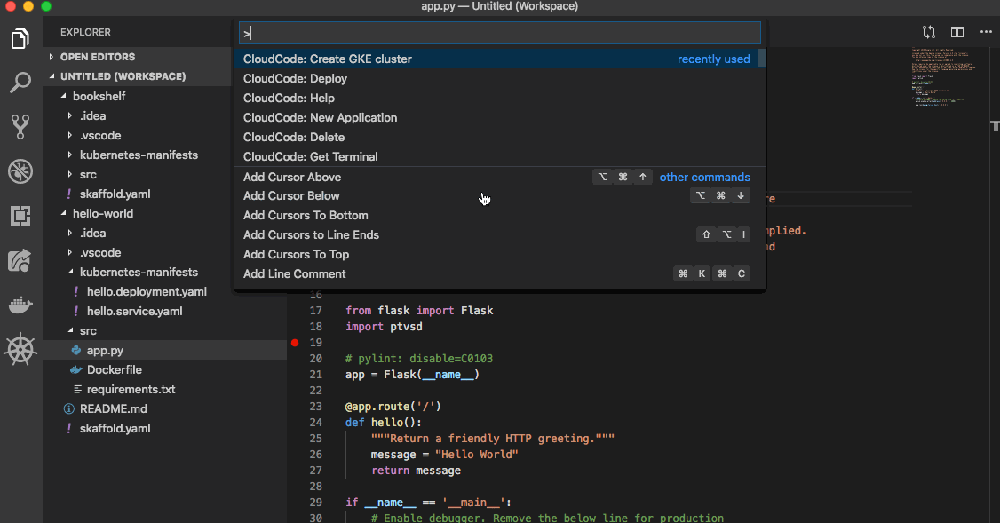

# Hello World


"Hello World" is a simple Kubernetes application that contains a single
[Deployment](https://kubernetes.io/docs/concepts/workloads/controllers/deployment/) and a corresponding 
[Service](https://kubernetes.io/docs/concepts/services-networking/service/). The Deployment contains a 
[Flask-based](http://flask.pocoo.org/) web server that simply prints "Hello World".

 | We will be using [Kubernetes terminology](https://kubernetes.io/docs/reference/glossary/?fundamental=true) throughout in this document
-----|------

----

## Table of Contents
1. [Getting Started](#getting-started)
2. [Included Files](#included_files)
3. [Using Cloud Code](#using-cloudcode)
    1. [Set up a Google Kubernetes Engine Cluster](#set-up-a-google-kubernetes-engine-cluster)
    2. [Launch a Deployment](#launch-a-deployment)
    3. [View Container Logs](#view-container-logs)
    4. [Debug Your Code](#debug-your-code)
    5. [Open a Terminal in Your Container](#open-a-terminal-in-your-container)
    6. [Tasks](#tasks)
4. [Using the Command Line](#using-the-command-line)
    1. [Using Skaffold](#using-skaffold)
    2. [Using kubectl](#using-kubectl)

----

## Getting Started
This sample was written to demonstrate how to use the Cloud Code extension for Visual Studio code. If you open this folder in Visual Studio Code,
you should be prompted to install the extension automatically.


Instructions for manually installing the extension and prerequisites can be 
[found here.](https://github.com/GoogleCloudPlatform/vscode-extensions-docs/blob/master/getting_started.md) 


## Included Files
- .vscode
  - `extensions.json`: prompts Visual Studio Code users to download the related extensions when opening this project
  - `launch.json`: information needed for the debugger to attach to our service
  - `tasks.json`: config information for [Visual Studio Code Tasks](https://code.visualstudio.com/docs/editor/tasks)
- kubernetes-manifests
  - `hello.deployment.yaml`: Kubernetes manifest for the Hello World Deployment
  - `hello.service.yaml`: Kubernetes manifest for the Hello World LoadBalancer Service
- src
  - `app.py`: Python code with the web server logic
  - `Dockerfile`: used to build the container image for our program
  - `requirements.txt`: describe the required Python dependencies
- `skaffold.yaml`: config file for [Skaffold](https://github.com/GoogleContainerTools/skaffold), which is used by Cloud Code to build and deploy images

## Using CloudCode
### Set up a Google Kubernetes Engine Cluster
- Open the [Command Palette](https://code.visualstudio.com/docs/getstarted/userinterface#_command-palette)
- Type "CloudCode: Create GKE cluster"
- Cloud Code will open a UI to enter your GCP information
- When finished, you will see your cluster listed under the [GKE Explorer view](https://github.com/GoogleCloudPlatform/vscode-extensions-docs/blob/master/gke_explorer.md)


### Launch a Deployment

- Open the [Command Palette](https://code.visualstudio.com/docs/getstarted/userinterface#_command-palette)
- Type "CloudCode: Deploy"
- Select "hello-world" as the application to deploy
- Select "local" to build containers using your local Docker, or "staging" to build using [Google Cloud Build](https://cloud.google.com/cloud-build/)
- An output window will appear showing the results of your deployment
- When complete, the output window will display an IP address you can use to access your service over the internet


#### Initiate Continuous Deployment
When you enable continuous deployment, Cloud Code will watch your code for any changes. Each time you update a file, it will automaticaly build, push, and deploy a new version of your application
- Open the [Command Palette](https://code.visualstudio.com/docs/getstarted/userinterface#_command-palette)
- Type "CloudCode: Deploy"
- Select "hello-world" as the application to deploy
- Select "local" to build containers using your local Docker, or "staging" to build using [Google Cloud Build](https://cloud.google.com/cloud-build/)
- An output window will appear showing the results of your deployment
- Now, update the message returned by the server in app.py and save the file. Cloud Code will notice the change and automatically push and deploy a new version of your application automatically

### View Container Logs
- Open the [Command Palette](https://code.visualstudio.com/docs/getstarted/userinterface#_command-palette)
- Type "CloudCode: View Logs"
- Select the pod you wish to see the logs from
- A new file will open populated with the standard output of the hello-world container


### Debug Your Code
-  Open [Debug view](https://code.visualstudio.com/Docs/editor/debugging)
- Select "hello-world" as the debug configuration in the dropdown menu
- Press the debug start button to attach a debugger session to the hello-world application
  - Cloud Code usses the .vscode/launch.json file to locate the pods to attach a debug session to
  - the hello-world container was built to run `ptvsd` to support debugging
- You should see the [Debug toolbar](https://code.visualstudio.com/Docs/editor/debugging#_debug-actions) with familiar debug controls
- You can click in the margin in `app.py` to add a breakpoint. When you send a new request to your application, it will pause at the desired line
- You can inspect variables and stack info in the [Debug Side Bar](https://code.visualstudio.com/Docs/editor/debugging)
- You can interact with the debugging session using the [Debug Console](https://code.visualstudio.com/Docs/editor/debugging#_debug-console-repl) in the bottom pane


### Open a Terminal in Your Container
By opening a terminal, you can monitor and debug running processes as though they were running on your local machine
- Open the [Command Palette](https://code.visualstudio.com/docs/getstarted/userinterface#_command-palette)
- Type "CloudCode: Get Terminal"
- Select the pod you wish to connect to
- You now have access to a shell inside the running container


### Tasks
This sample also includes a number of [Visual Studio Code Tasks](https://code.visualstudio.com/docs/editor/tasks) to launch common commands

#### Run the Pylint Task
Run a Python [linter](https://en.wikipedia.org/wiki/Lint_(software)) to analyze your code for issues
- [Install Pylint](https://www.pylint.org/#install) if necessary
- Open the [Command Palette](https://code.visualstudio.com/docs/getstarted/userinterface#_command-palette)
- Type "Tasks: Run Task"
- Select the "Pylint" task
- An output window will appear showing the Pylint output


---

## Using the Command Line
As an alternative to using the Cloud Code extension, the application can be deployed to a cluster using standard command line tools

### Using Skaffold
[Skaffold](https://github.com/GoogleContainerTools/skaffold) is a command line tool that can be used to build, push, and deploy your container images as you work

```
skaffold run
```

### Using kubectl

[kubectl](https://kubernetes.io/docs/tasks/tools/install-kubectl/) is the official Kubernetes command line tool. It can be used to deploy Kubernetes manifests to your cluster, but images must be build seperately using another tool (for example, using the [Docker CLI](https://docs.docker.com/engine/reference/commandline/cli/)) 

#### Build Container Images:
```
IMAGE_REPO="gcr.io/your-project-here/"
docker build -t $IMAGE_REPO/hello-world ./src
docker push $IMAGE_REPO/hello-world
```
#### Deploy Manifests
Note that you may need to edit hello.deployment.yaml's image field to match `$IMAGE_REPO/hello-world`
```
kubectl apply -f ./kubernetes-manifests
```
 | you may need to edit hello.deployment.yaml's image field to match `$IMAGE_REPO/hello-world`
-----|------
